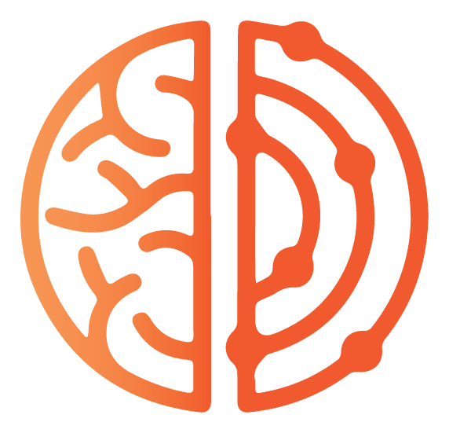

# Session Handoff Summary
**Date:** May 7, 2026
**Session topic:** Replaced Fathom MCP with local transcript pipeline; updated daily call prep; fixed RWI brand icon

## 1. What We've Covered So Far

This session started as an automated daily-call-prep run. During the prep, the Fathom MCP's `get_meeting_details` tool returned 404 errors for every recording. Chris asked me to diagnose the problem, which led to discovering the root cause (recording ID mismatch in the connector) and then a full migration away from the Fathom MCP in favor of local transcript files that were already being synced nightly by scripts we'd built earlier.

Three scripts existed on Chris's Mac for Fathom transcript management: `fathom_pull.py` (v1, markdown output, 11 PM), `fathom_organizer.py` (v2, .docx output with Claude naming, 9 AM), and `daily-transcript-rename.sh` (Claude Code headless renaming, 6:10 AM). I merged v1 and v2 into a single script `fathom_sync.py` (v3) that outputs both .md and .docx, uses checkpoint-based sync, Claude Haiku naming for generic titles, retry logic for 502 errors, and duplicate detection. All three old LaunchAgents were disabled and replaced with one new one (`com.rw.fathom-sync`, 11 PM nightly).

The daily call prep was re-run using local transcript files instead of the Fathom MCP. The difference was dramatic: two full Logitech/Jennifer Treopaldo transcripts (March 25 and April 15) surfaced rich context the MCP could never retrieve, and Sarah Welch from ideas42 turned out to have been on yesterday's Makerspace call. An RWI-branded HTML briefing was produced.

At the end, Chris flagged that the RWI brain icon was missing from the HTML. Investigation showed the `rwi-brand-apply` skill has NO icon files bundled in it, and the `logos.json` base64 manifest referenced in older docs doesn't exist. The fix was to copy the PNG from the Brand-Protocol folder to the output folder and reference it locally. The Brand-Protocol CLAUDE.md was updated with explicit instructions. But the skill's own SKILL.md is in a read-only plugin install directory and could not be edited this session.

## 2. Big Decisions Made

**Replace Fathom MCP with local transcript files.** The Fathom connector's `get_meeting_details` and `get_meeting_transcript` tools have a recording ID mismatch bug. Rather than wait for a fix, Chris chose to disable the connector entirely and read .md transcript files from disk. The local files are richer (full transcripts vs. summaries) and more reliable.

**Merge three scripts into one.** `fathom_pull.py` + `fathom_organizer.py` + rename script consolidated into `fathom_sync.py`. Both .md and .docx output per transcript. Single LaunchAgent at 11 PM.

**Claude Haiku naming enabled.** Installed the `anthropic` Python package and saved the API key at `~/Documents/Dev/.claude_api_key`. Generic Fathom titles like "Impromptu Microsoft Teams Meeting" now get renamed by Haiku.

**Brand icon must be copied, not embedded or recreated.** The CLAUDE.md now explicitly says logos.json doesn't exist and that the PNG must be copied to the output folder for any HTML saved outside Brand-Protocol.

## 3. Where We're Leaving Off (Current To-Do State)

- [x] Diagnosed Fathom MCP get_meeting_details 404 bug
- [x] Built fathom_sync.py (v3) merging v1 + v2
- [x] Installed new LaunchAgent (com.rw.fathom-sync, 11 PM)
- [x] Disabled three old LaunchAgents
- [x] Installed anthropic package + saved API key
- [x] Migrated checkpoint
- [x] Test run of fathom_sync.py (passed)
- [x] Blocked Fathom MCP connector in Cowork
- [x] Updated daily-call-prep SKILL.md (uses local transcripts)
- [x] Updated tech-review-digest SKILL.md (uses local transcripts)
- [x] Updated refresh-rw-dashboard SKILL.md (uses local transcripts)
- [x] Re-ran daily call prep using local transcripts (dramatically better)
- [x] Produced RWI-branded HTML briefing
- [x] Copied rwi-icon-orange.png to Transcripts folder
- [x] Updated Brand-Protocol CLAUDE.md with explicit icon copy instructions
- [ ] **Republish rwi-brand-apply plugin with updated SKILL.md** -- the installed plugin's SKILL.md still references icon files as though they're bundled in the skill folder. It needs the "copy the PNG from Brand-Protocol" instructions added, and the dead logos.json reference removed. The SKILL.md content I wanted to write is in this handoff under "Next AI instructions."

## 4. What the Next AI Should Do First

### Mount these folders:
1. `/Users/realizedworth/Library/CloudStorage/Dropbox-RealizedWorth/RWI/⭐ Active/Brand-Protocol` -- contains the canonical icon PNGs and the updated CLAUDE.md
2. `/Users/realizedworth/Documents/Claude` -- contains the scheduled tasks

### Then do this:

**Republish the `rwi-brand-apply` skill (part of the `rwi-brand-protocol` plugin).** The goal is to update the skill's SKILL.md so the Logo section includes:

1. Explicit statement that **the skill folder does not contain icon files**
2. Full Dropbox paths to the canonical PNGs: `/Users/realizedworth/Library/CloudStorage/Dropbox-RealizedWorth/RWI/⭐ Active/Brand-Protocol/assets/logo/rwi-icon-orange.png` (and white, black variants)
3. A mandatory step to **copy the PNG to the output folder** before referencing it in HTML, with the exact `cp` command
4. A note that `logos.json` does not exist and should not be looked for
5. The bash sandbox mount path for the Brand-Protocol folder (for Cowork sessions)

The key passage to add to the Logo section (replacing the current content from line 162-203 of the SKILL.md):

```
**This skill folder does NOT contain the icon files.** You must copy them from the Brand-Protocol folder to the output directory. This is a required step, not optional.

Step 1: Copy the icon to the output folder using bash:
  cp "/Users/realizedworth/Library/CloudStorage/Dropbox-RealizedWorth/RWI/⭐ Active/Brand-Protocol/assets/logo/rwi-icon-orange.png" /path/to/output/folder/rwi-icon-orange.png

Step 2: Reference it with a flat relative path in HTML:
  

Never recreate the icon with CSS, SVG paths, colored circles, or emoji.
The logos.json base64 manifest does not exist. Do not look for it.
```

Use the `skill-creator` skill to update and republish the plugin. The plugin is called `rwi-brand-protocol` and the skill within it is `rwi-brand-apply`.
